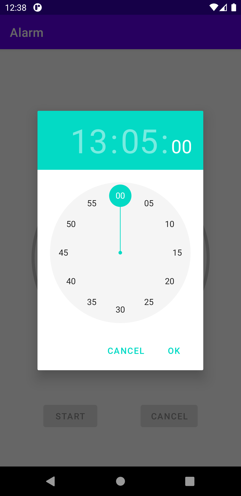
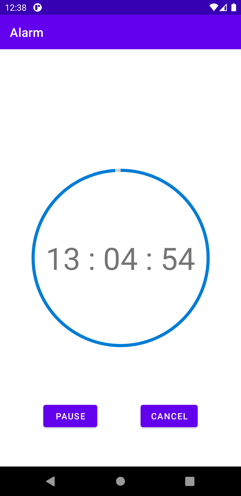
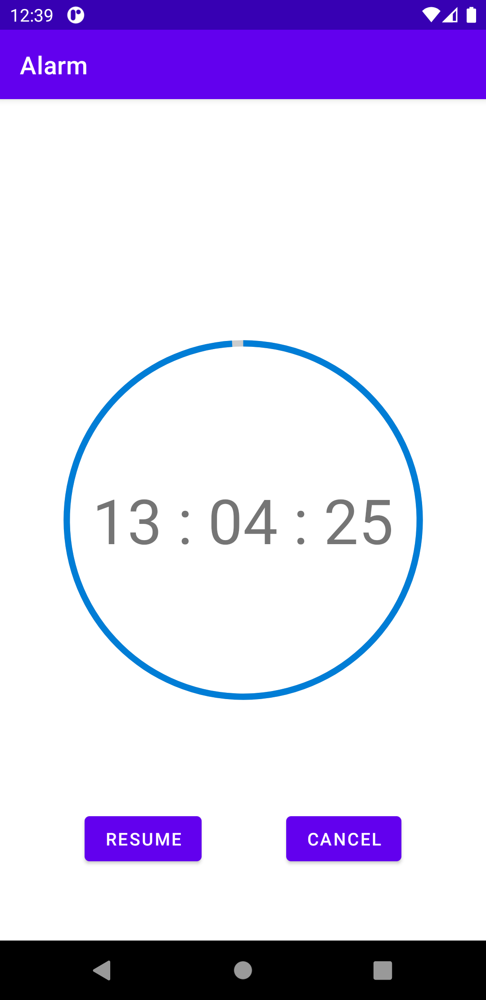
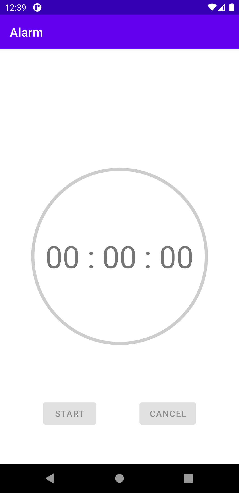

# Simple Alarm

## Approach
    - ViewModel's managing the state of Timer
    - TimerActivity's View, observe state from ViewModel, showing the right UI for each state, TimerActivity's also entry point for receiving user's interactions
    - When app's in background, using AlarmManager for running the timer
    - When app's in foreground, using CountDownTimer
    
## Structure
    - PerfUtils: Preferences helper functions are help to save time data for saving the previous timer, make sure when user resume app, the timer's still running
    - TimerBackground: running timer in background interface, in implementation, it's using AlarmManager to handle timer when app's in background
    - TimerExpiredReceiver: The BroadCastReceiver's reveiving event when the alarm manager's timer end
    - TimerActivity: View
    - TimerViewModel: ViewModel
    - Utils: Time helper functions 
    
## Screenshot
    
   
    
   

## APK
   [latest](./Alarmv1.0.apk)

   
    